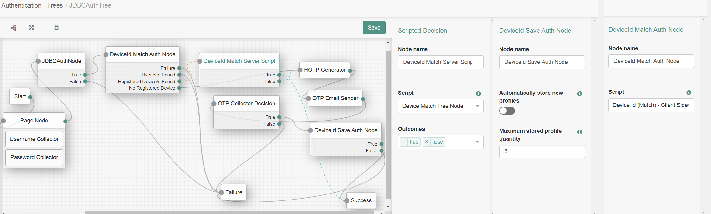

<!--
 * The contents of this file are subject to the terms of the Common Development and
 * Distribution License (the License). You may not use this file except in compliance with the
 * License.
 *
 * You can obtain a copy of the License at legal/CDDLv1.0.txt. See the License for the
 * specific language governing permission and limitations under the License.
 *
 * When distributing Covered Software, include this CDDL Header Notice in each file and include
 * the License file at legal/CDDLv1.0.txt. If applicable, add the following below the CDDL
 * Header, with the fields enclosed by brackets [] replaced by your own identifying
 * information: "Portions copyright [year] [name of copyright owner]".
 *
 * Copyright 2019 ForgeRock AS.
-->
# DeviceId

This node collects device(browser) infomation by running javascript at client i.e browser and compare device profile if already exists and saves it to the user profile

Copy the .jar file from the ../target directory into the ../web-container/webapps/openam/WEB-INF/lib directory where AM is deployed.  Restart the web container to pick up the new node.  The node will then appear in the authentication trees components palette.

## Components

Comes with 2 nodes:
* **DeviceIdMatchNode**: Runs Device Id (Match) - Client Side script which comes with product. Returns if any any device is registered or not.
* **DeviceIdSaveNode**: Saves output returned by DeviceIdMatchNode to user profile

NOTE: A scripted node is required to Match device information collected by DeviceIdMatchNode against the user profile. See the script in Code. You need to add below classes to Global Services Scripting engine configuration whitelist for AUTHENTICATION_TREE_DECISION_NODE:

java.util.ArrayList$Itr
org.forgerock.openam.core.rest.devices.deviceprint.DeviceIdDao

## Example configuration

